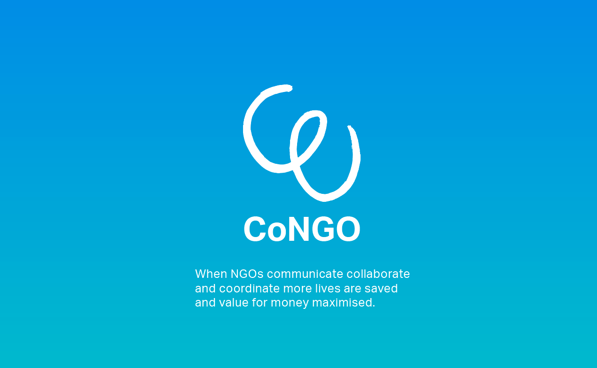
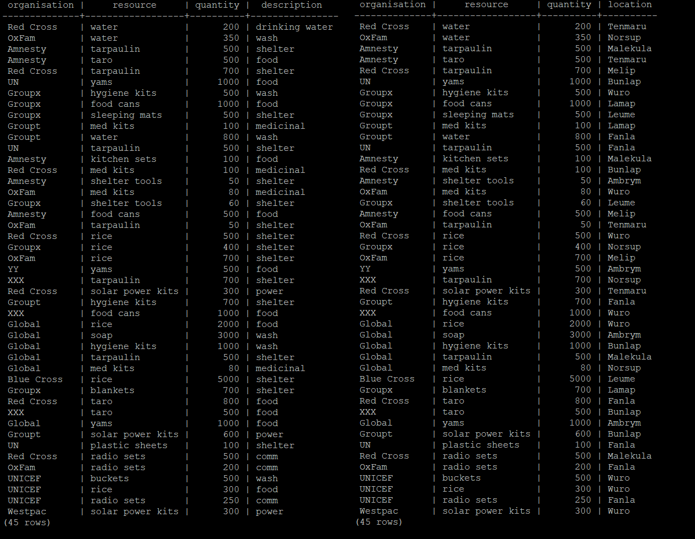

# congo-hadr
Repo for prototypes as part of Techstars Startup Weekend Wellington 2018. The theme is humanitarian assistance and disaster relief (HADR.)

## The Problem
Disaster relief has the potential to suffer from lack of organisation, synergy, collaboration, coordination and communication as the non-government organisations (NGOs) that participate are typically competing against each other. As a result, they rarely work together to solve problems as they are more focused on the funding, PR and prestige they receive from controlling operations without assistance.

## Our Solution

We aim to improve HADR operations by proposing **CoNGO**, a specialised data storage platform for disaster relief management. Currently, disaster management offices (DMOs) are responsible for controlling data and resources regarding NGOs and humanitarian services. CoNGO will comprise an underlying database which is accessible via a dedicated API or a supplementary application. The API is designed to be accessible by existing applications already in use by NGOs. Alternatively, the application may be used to get a more natural experience working with the database.

## My Role

I was in charge of development and technical validation. I worked closely with designers and UX team members to create prototypes for the database and associated connections. The end result was a visual experience for mentors and judges to view, along with a database and associated API which this repo holds.

On the technical side, this repo contains a simple PostgreSQL database setup and an associated JDBC API.

### References and Links
- Thanks to Devdactic for the Ionic tutorial at https://devdactic.com/ionic-side-menu-tabs/
- F6S site: https://www.f6s.com/profile/2723594/about

### Contributors to this repo
- Liam Byrne (github.com/byrneliam2)
- Richard Jiang (github.com/rjiang43)

See the F6S page for the whole team!
